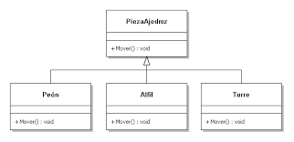

> # Polimorfismo
---
<!-- El **polimorfismo** es la capacidad que tienen los objetos de una clase en ofrecer respuestas distintas e independientes en función de los parámetros. También se suele definir como la sobrecarga de parámetros -->
El **polimorfismo** en la programación orientada a objetos se refiere a la posibilidad de definir clases diferentes que tienen métodos o atributos denominados de forma idéntica, pero que se comportan de manera distinta.
## Tipos de polimorfismo:

* Polimorfismo de sobrecarga
* Polimorfismo paramétrico
* Polimorfismo de inclusión

